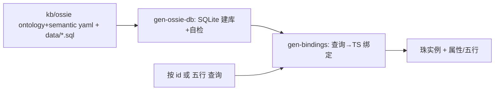
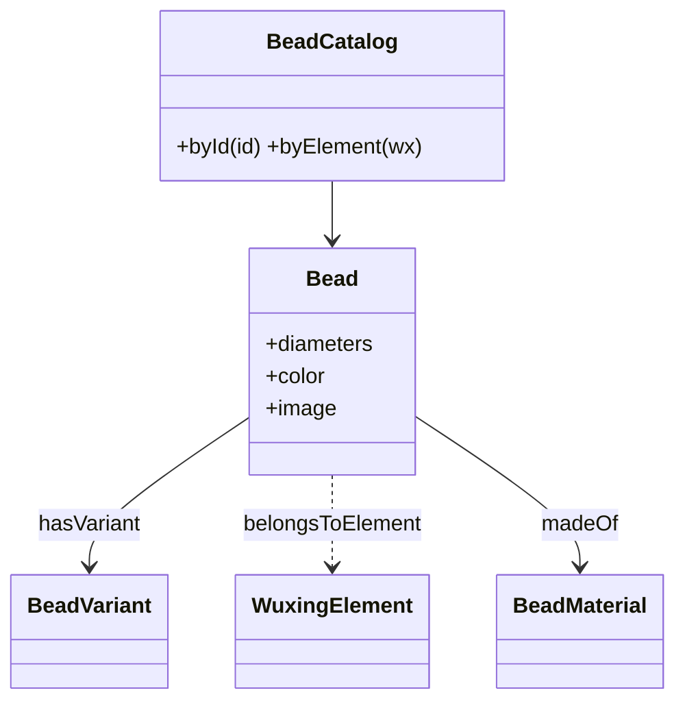
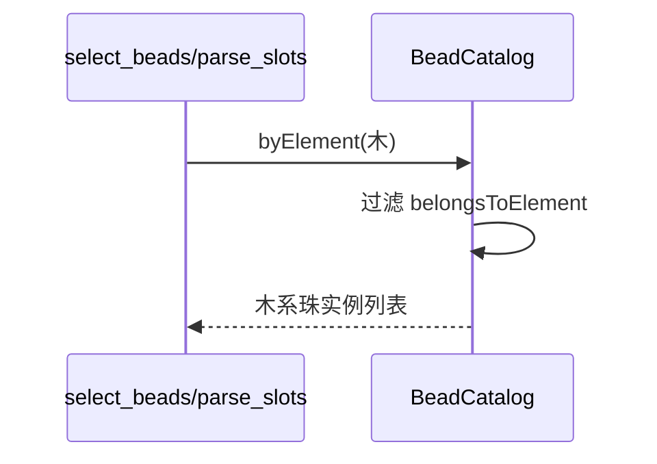
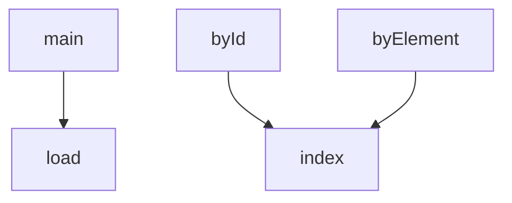

## 它做什么

提供手串珠子库本体：珠实例、变体、五行归属、直径、颜色与图片。确定性实现：不调用 LLM、不依赖网络、可重复可测试（CPU 上“算账”）。

珠子库本体遵循 Apache Ossie（v0.2）：概念/关系/约束在 `bead.ontology.yaml`，dataset/字段语义在 `bead_catalog.semantic.yaml`，33 个珠实例以 SQLite 行存于 `kb/ossie/data`；生成绑定供引擎只读。图片资源与实例 1:1 随原子打包。

## 怎么实现

**1) 数据流转（flowchart：一份数据从输入到输出怎么走）**

**2) 模块分解（classDiagram：代码/类怎么划分与归属）**

**3) 交互时序（sequenceDiagram：调用方与本原子/下游怎么协作）**

**4) 调用图（graph：本原子及其 import 的下游组合关系）**

## 何时用

- 适用：筛珠/求解/解析/SVG 渲染读取可用珠的唯一珠源；换库存只需换本体实例不碰代码。
- 不适用：不含“哪些珠可用”的判断（那是 select_beads + 规则的事）。

## 示例

输入 { bead_id: "xiaoye-zitan_round" } → 输出 { name: 小叶紫檀, wuxing: 木, variant: round, diameters: [6,8,10,12], color: "#5B2333", image: "/beads/trimmed/xiaoye-zitan_round.png" }。
