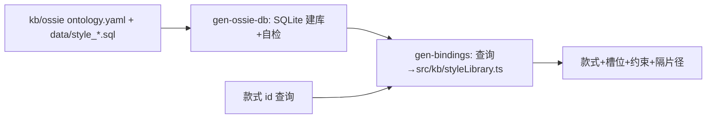
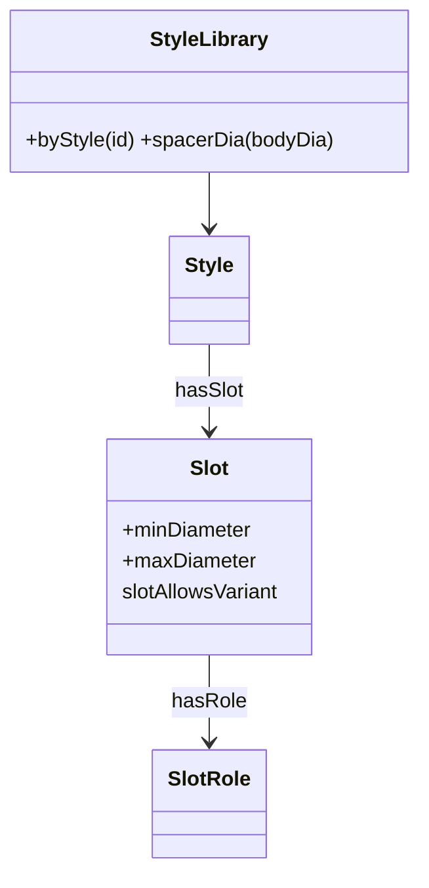
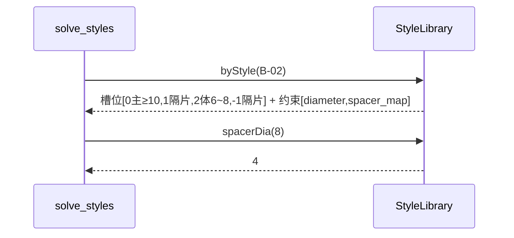
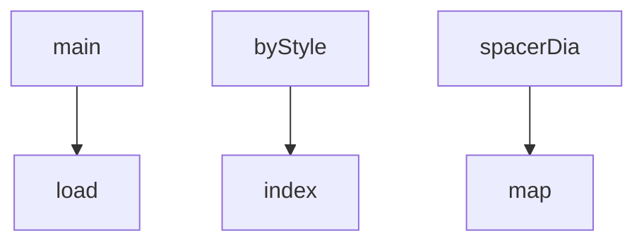

## 它做什么

提供手串款式库本体：款式结构、槽位、允许变体/直径约束与隔片径映射。确定性实现：不调用 LLM、不依赖网络、可重复可测试（CPU 上“算账”）。

样式库遵循 Apache Ossie（ontology.yaml 的 Style/Slot 概念 + style_catalog.semantic.yaml）：款式/槽位/约束/隔片径拆为 SQLite 行，由 gen-bindings 还原引擎 Style[]，求解引擎按其生成解空间。

## 怎么实现

**1) 数据流转（flowchart：一份数据从输入到输出怎么走）**

**2) 模块分解（classDiagram：代码/类怎么划分与归属）**

**3) 交互时序（sequenceDiagram：调用方与本原子/下游怎么协作）**

**4) 调用图（graph：本原子及其 import 的下游组合关系）**

## 何时用

- 适用：求解引擎在给定款式下枚举组合前读取槽位与约束声明。
- 不适用：不含枚举/校验算法，不含“某组合是否可行”的执行。

## 示例

输入 { style_id: "B-02" } → 输出 4 个槽位与 2 条约束；spacer_map 6→4 / 8→4 / 10→5 / 12→6。
