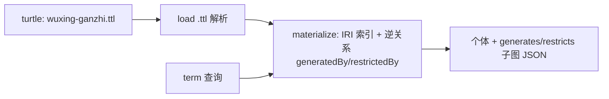
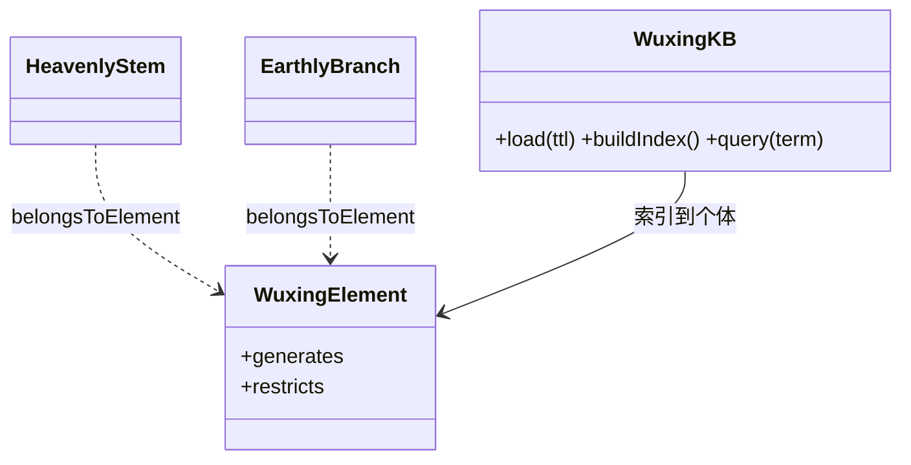
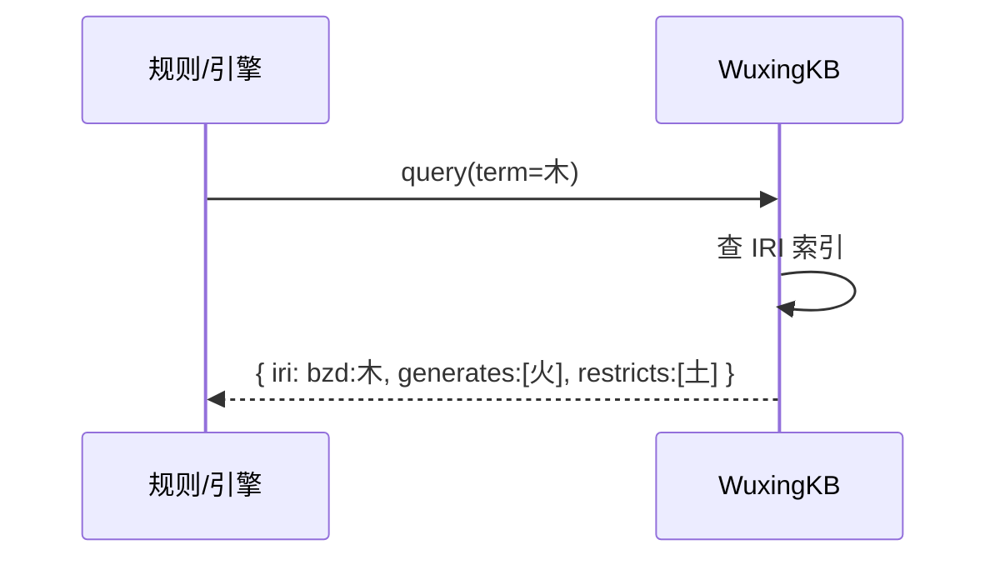
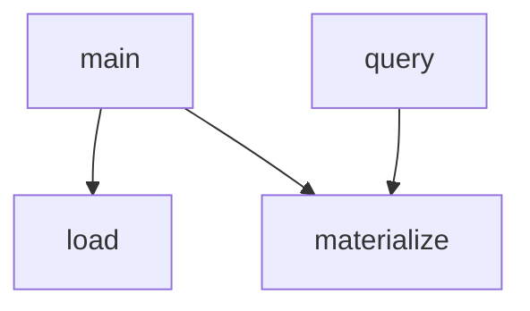

## 它做什么

提供五行、天干、地支、节气的概念与个体及生克关系本体。确定性实现：不调用 LLM、不依赖网络、可重复可测试（CPU 上“算账”）。

词库本体是全系统唯一事实源：五行/天干/地支/时节以 RDF 个体存在；生/克建模为 WuxingElement 上的对象属性（含逆关系），供旺衰/喜忌规则与排盘以 IRI 引用，杜绝字符串重复。

## 怎么实现

**1) 数据流转（flowchart：一份数据从输入到输出怎么走）**

**2) 模块分解（classDiagram：代码/类怎么划分与归属）**

**3) 交互时序（sequenceDiagram：调用方与本原子/下游怎么协作）**

**4) 调用图（graph：本原子及其 import 的下游组合关系）**

## 何时用

- 适用：任何需要唯一引用 五行/干支/节气 术语的规则、引擎或外部系统；获取 生/克 邻接以推喜忌。
- 不适用：本原子只回答“是什么/有什么关系”，不做任何判定或计算。

## 示例

输入 { term: "木" } → 输出 { iri: "bzd:木", generates: ["火"], restricts: ["土"] }；输入 {} 返回全量词表（10 天干/12 地支/12 时节 + 5 元素生克图）。
